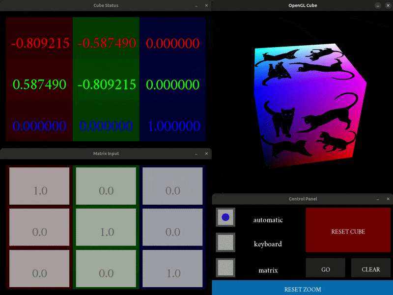
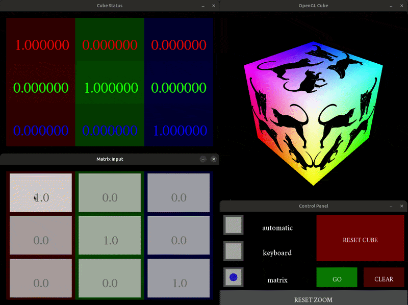

# VisualizerLinearTransforms
This is a simple program for visualizing how a 3x3 matrix can transform a 3D space. Custom matrix values can be given as input and the *cat cube* will be transformed accordingly. This is a supplementary material for the [mathematics tutorship](https://diegobarmor.github.io/maths-tutorship/).




## Quickstart
Depends on GLEW/GLM (OpenGL) and the SFML based [ALMOND GUI](https://diegobarmor.github.io/almond/) (v0.1.0).

```bash
bash scripts/install_dependencies.sh # only the first time an ALMOND/SFML project is used
bash scripts/build.sh
bash scripts/run.sh
```
